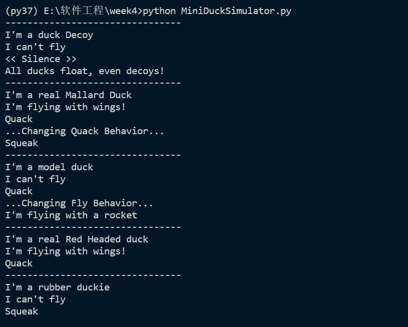

# SimDuck
## 项目简介
通过python，采用策略模式实现模拟鸭子。采用Duck()作为基类，分离出鸭子特征容易出现变化的部分，通过继承的方式实现不同类型鸭子的特征，同时可以通过set方法修改鸭子特征。
## 项目结构
	WorkingDirection/
	├────DuckClass/
	│    ├────__init__.py
	│    ├────DecoyDuck.py
	│    ├────Duck.py
	│    ├────MallardDuck.py
	│    ├────ModelDuck.py
	│    ├────RedHeadDuck.py
	│    └────RubberDuck.py
	├────FlyClass/
	│    ├────__init__.py
	│    ├────FlyBehavior.py
	│    ├────FlyNoWay.py
	│    ├────FlyRocketPowered.py
	│    └────FlyWithWings.py
	├────MiniDuckSimulator.py
	├────QuackClass/
	│    ├────__init__.py
	│    ├────FakeQuack.py
	│    ├────MuteQuack.py
	│    ├────Quack.py
	│    ├────QuackBehavior.py
	│    └────Squeak.py
	├────README.md
	└────Test/（用于单个演示）
	│    └────Test.py
## 项目演示
- 下载文件到本地
- 打开文件目录，运行命令： python MiniDuckSimulator.py
- 运行结果如下

